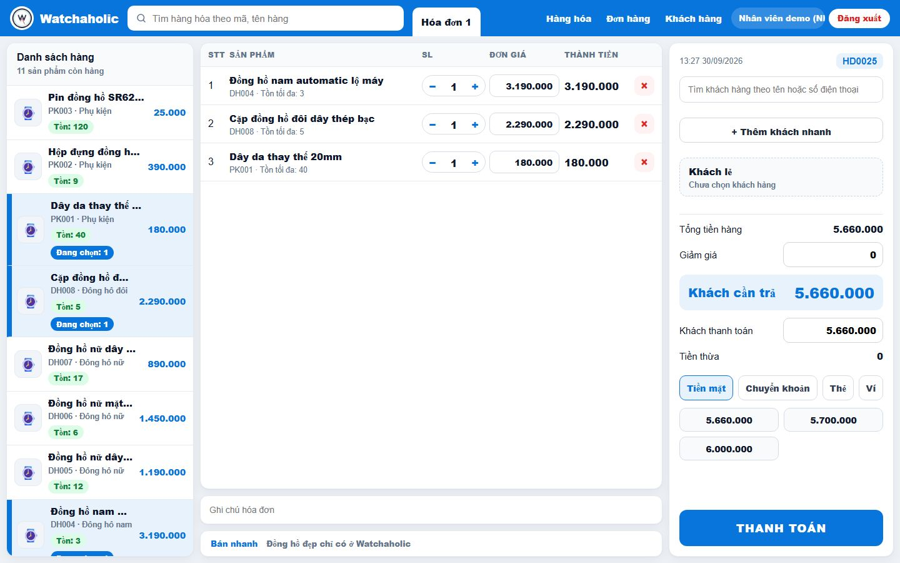
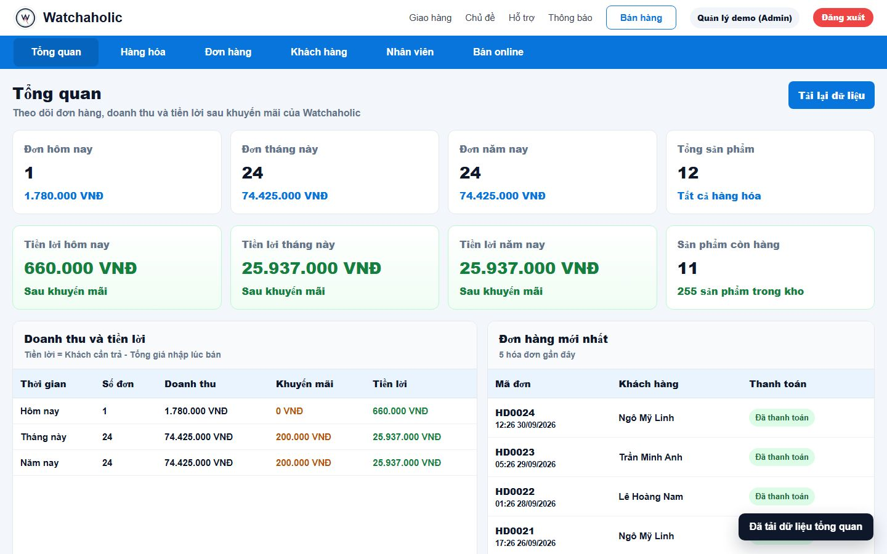
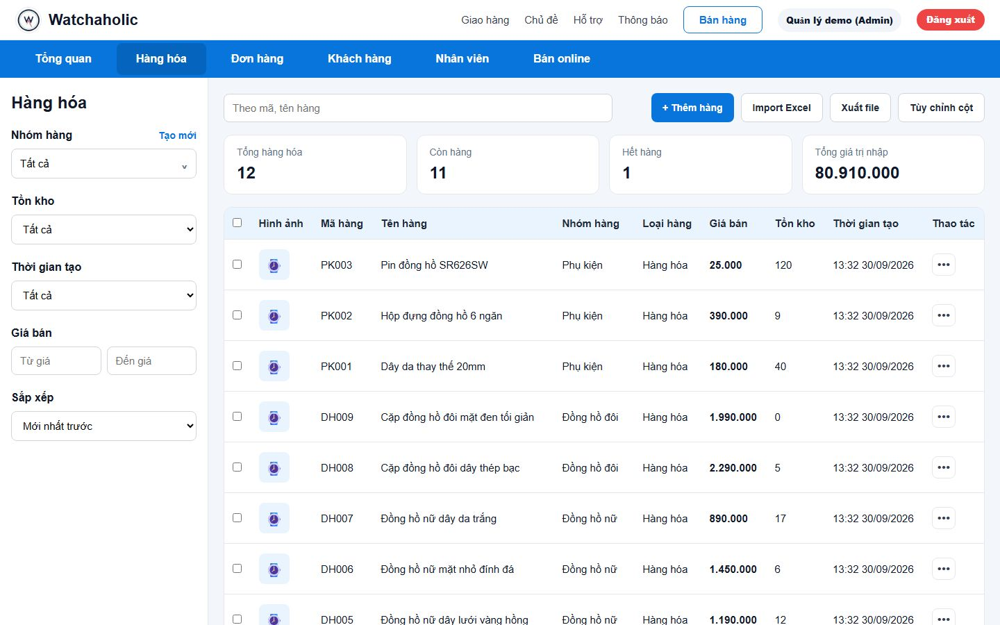
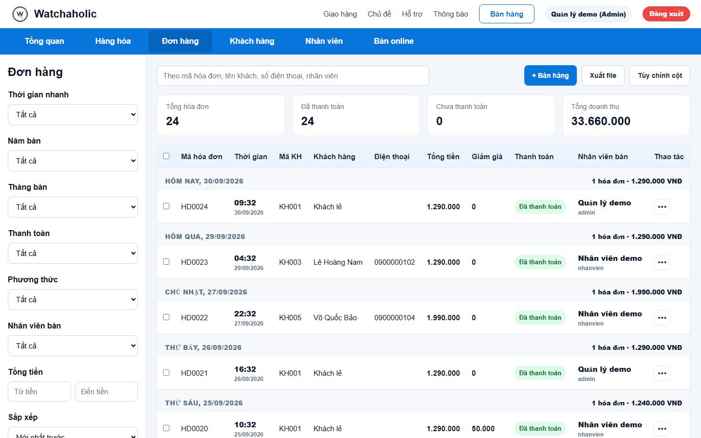
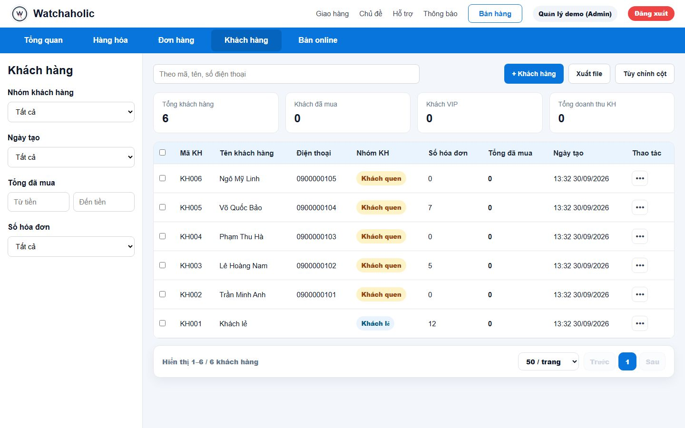
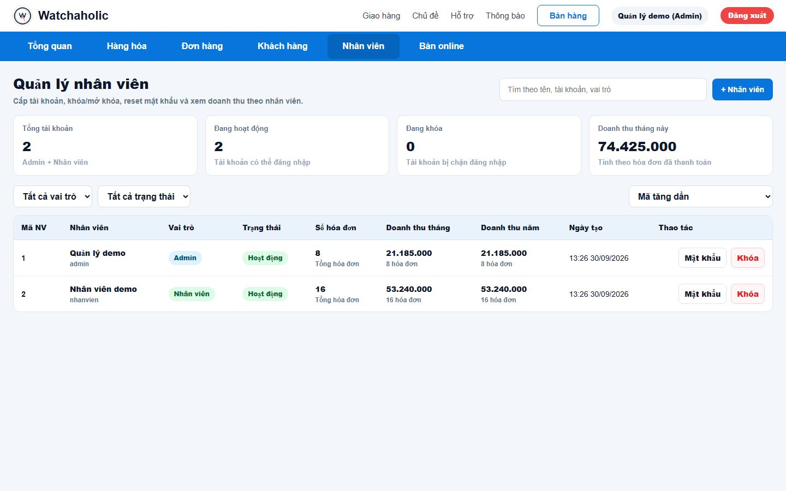
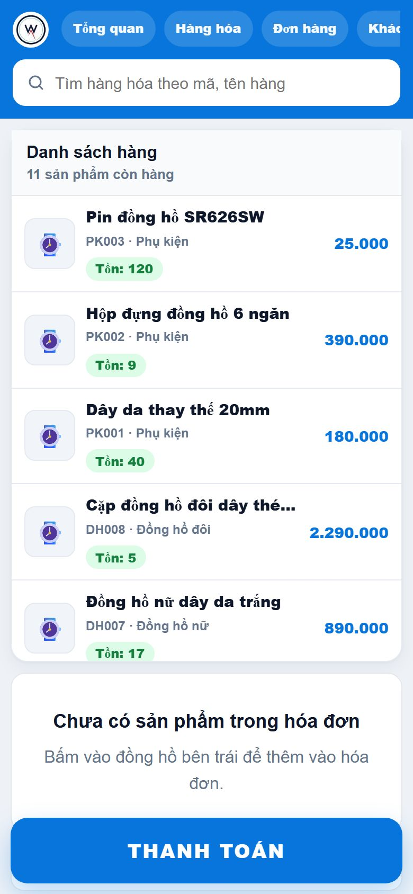
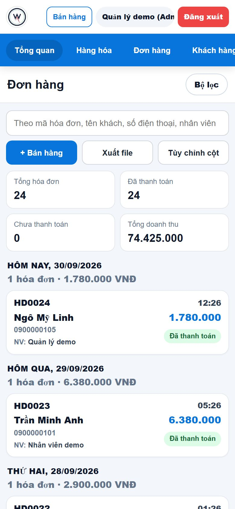
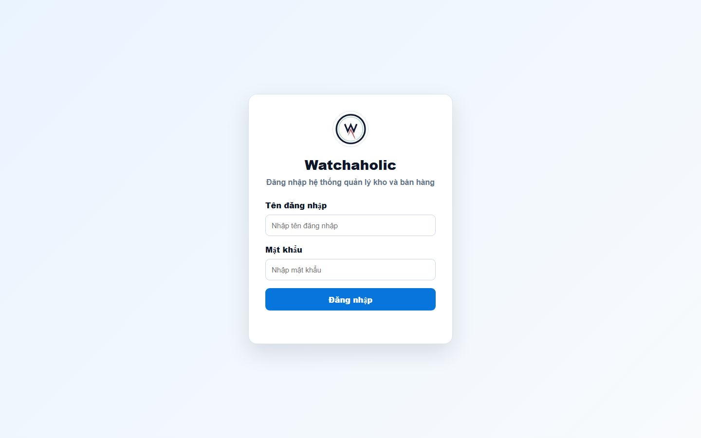

# Watchaholic

Web quản lý kho và bán hàng mình làm cho một cửa hàng đồng hồ. Nhân viên bán hàng ngay trên máy tính hoặc điện thoại, còn chủ cửa hàng mở ra là thấy doanh thu và tiền lời theo ngày, tháng, năm.

Chủ cửa hàng và nhân viên đã quen dùng KiotViet, nên họ muốn giao diện mới trông tương tự để không phải tập lại từ đầu. Mình giữ cách bố trí quen thuộc đó, rồi chỉnh sửa và bổ sung những chức năng cần thiết dành riêng cho việc bán đồng hồ.

> Repo này mình để công khai để giới thiệu dự án. Code nằm ở repo riêng vì hệ thống đang dùng cho cửa hàng thật. Ai cần xem code thì nhắn mình, mình mở quyền hoặc demo trực tiếp.
>
> Ảnh bên dưới chụp từ bản chạy thử với dữ liệu giả, không phải dữ liệu của cửa hàng.

## Web gồm những gì

**Bán hàng tại quầy.** Bấm vào đồng hồ bên trái là thêm vào hóa đơn, chỉnh số lượng và giá ngay trên dòng, tìm hoặc thêm nhanh khách hàng, chọn cách thanh toán (tiền mặt, chuyển khoản, thẻ, ví). Web gợi ý sẵn số tiền khách đưa để tính tiền thừa cho nhanh. Mỗi hóa đơn có mã riêng (HD0001, HD0002...).

**Tổng quan cho chủ cửa hàng.** Số đơn, doanh thu và tiền lời theo ngày, tháng, năm. Tiền lời tính theo giá nhập tại lúc bán, nên sau này có đổi giá nhập thì số liệu của đơn cũ vẫn đúng.

**Hàng hóa.** Quản lý sản phẩm theo nhóm hàng, lọc theo tồn kho, thời gian tạo, khoảng giá. Nhập hàng loạt bằng file Excel và xuất ra Excel khi cần.

**Đơn hàng.** Hóa đơn gom theo từng ngày kèm tổng tiền của ngày đó, lọc theo tháng, năm, cách thanh toán, nhân viên bán, khoảng tiền.

**Khách hàng và nhân viên.** Lưu khách quen và tổng số tiền họ đã mua. Chủ cửa hàng tạo tài khoản cho nhân viên.

<table>
<tr>
<td width="50%"></td>
<td width="50%"></td>
</tr>
</table>

**Dùng được trên điện thoại.** Nhân viên có thể bán hàng và xem đơn ngay trên điện thoại:

  
  
  

## Phân quyền

Có 2 vai trò. **Admin** (chủ cửa hàng) vào được hết, kể cả trang tổng quan và quản lý nhân viên. **Nhân viên** chỉ bán hàng, xem hàng hóa, đơn hàng và khách hàng. Server kiểm tra quyền trước khi trả về từng trang, nên nhân viên gõ thẳng đường dẫn trang tổng quan cũng không vào được.

Mỗi khi có đơn mới hoặc đơn bị xóa, web gửi tin qua Telegram cho chủ cửa hàng.

## Những vấn đề mình đã xử lý

Trong quá trình làm và đưa hệ thống vào sử dụng ở cửa hàng, mình gặp một số vấn đề mà lúc code ban đầu không nghĩ tới. Có những lỗi chỉ lộ ra khi đã có dữ liệu bán hàng thật, cũng có những chỗ chỉ khi nhân viên dùng hằng ngày mới thấy bất tiện.

**Tiền lời của đơn cũ bị thay đổi theo giá nhập mới**  
Ban đầu mình tính lợi nhuận dựa trên giá nhập hiện tại của sản phẩm, nên chỉ cần chủ cửa hàng sửa giá nhập là số lời của các tháng trước cũng thay đổi theo. Mình chuyển sang lưu giá nhập vào từng dòng hóa đơn ngay tại thời điểm bán, đồng thời viết thêm một script để tính lại cho các đơn cũ.

**Hệ thống chậm và lỗi kết nối khi chạy trên Vercel**  
Vercel chạy theo kiểu serverless, mỗi request có thể tạo thêm một kết nối database mới, khiến hệ thống chậm và đôi lúc lỗi. Mình sửa lại để các request dùng chung một kết nối, và nếu database gặp sự cố thì chỉ request đó báo lỗi thay vì làm sập cả server.

**Giao diện trên điện thoại**  
Các bảng hàng hóa và đơn hàng có nhiều cột nên khi mở trên điện thoại bị vỡ bố cục. Mình làm riêng dạng danh sách thẻ cho màn hình nhỏ và giữ nút thanh toán luôn nằm ở cuối màn hình để nhân viên thao tác nhanh hơn.

**Thông báo đơn hàng cho chủ cửa hàng**  
Chủ cửa hàng muốn nắm được đơn mới ngay cả khi không có mặt ở cửa hàng. Mình dùng Telegram Bot để gửi thông báo mỗi khi có đơn mới hoặc đơn bị xóa, vừa miễn phí vừa đủ đáp ứng nhu cầu.

## Công nghệ

- Frontend: HTML, CSS, JavaScript thuần (không dùng framework), có giao diện riêng cho điện thoại
- Backend: Node.js, Express 5, REST API
- Database: MongoDB (Mongoose) trên MongoDB Atlas
- Đăng nhập: JWT lưu trong cookie, mật khẩu băm bằng bcrypt, phân quyền Admin / Nhân viên
- Excel: thư viện `xlsx` để nhập và xuất file
- Chạy trên: Vercel (serverless), dùng chung một kết nối database giữa các lần gọi

## Công cụ mình dùng

Giao diện mình không phác thảo bằng công cụ thiết kế mà dựa theo KiotViet, phần mềm mà cửa hàng đã quen dùng, kết hợp với cảm nhận của mình khi thử bán hàng trên đó để chỉnh lại cho gọn và hợp với việc bán đồng hồ.

Lúc làm dự án này, mình dùng ChatGPT (bản web) để hỗ trợ viết code, sau đó dùng Claude để review và sửa lại lỗi. AI giúp mình rút ngắn thời gian xử lý, nhưng việc quyết định nên làm tính năng nào, kiểm tra lại trên hệ thống thực tế và chỉnh sửa dựa trên phản hồi của chủ cửa hàng vẫn là phần mình trực tiếp thực hiện.

Với mình, AI là công cụ hỗ trợ để làm nhanh và hiệu quả hơn, còn chất lượng sản phẩm cuối cùng vẫn phụ thuộc vào cách mình kiểm tra, đánh giá và cải thiện nó qua quá trình sử dụng thực tế.

---

Nguyễn Thanh Toàn · [github.com/ntoan64](https://github.com/ntoan64)
